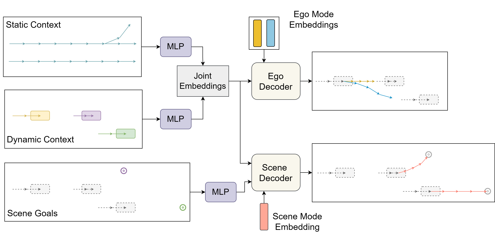

# Goal-Oriented Reactive Simulation for Closed-Loop Trajectory Prediction

This repository contains the official implementation for the paper "Goal-Oriented Reactive Simulation for Closed-Loop Trajectory Prediction". This work introduces an on-policy, closed-loop training paradigm optimized for high-frequency, receding horizon ego prediction. By employing a goal-oriented scene decoder, we create reactive surrounding agents. Our setup allows the ego to learn recovery behaviors from its own execution errors, while grounding ego prediction in realistic traffic interactions. Extensive evaluations demonstrate that this closed-loop approach significantly enhances collision avoidance compared to traditional open-loop baselines.



## Environment Generation

To set up the required environment, run the following command:

```bash
conda env create -f environment.yml
```

## nuScenes Data Preprocessing 

Follow these steps to download and preprocess the nuScenes dataset.

### 1. Download the data (nuScenes)

a. Register an account on the [nuScenes website](https://www.nuscenes.org/nuscenes#download).

b. Download the **metadata** for `v1.0-trainval` and `v1.0-mini`, as well as the **map_expansion-v1.3**.

c. After downloading, organize your `data/nuScenes/raw/` folder: 
   * The `maps` folder contains the extracted `map_expansion-v1.3` data, and you must manually copy the `.png` files from the `v1.0-trainval_meta/maps` folder into this directory.
   * The `v1.0-mini` and `v1.0-trainval` folders should contain their respective extracted JSON metadata files.

Your final directory structure under `data/nuScenes/raw/` should look exactly like this:

```text
data/nuScenes/raw/
├── maps/
│   ├── basemap/
│   ├── expansion/
│   ├── prediction/
│   ├── 36092f0b03a857c6a3403e25b4b7aab3.png
│   ├── 37819e65e09e5547b8a3ceaefba56bb2.png
│   ├── 53992ee3023e5494b90c316c183be829.png
│   ├── 93406b464a165eaba6d9de76ca09f5da.png
│   └── LICENSE
├── v1.0-mini/
│   ├── attribute.json
│   ├── calibrated_sensor.json
│   ├── category.json
│   ├── ego_pose.json
│   ├── instance.json
│   ├── log.json
│   ├── map.json
│   ├── sample.json
│   ├── sample_annotation.json
│   ├── sample_data.json
│   ├── scene.json
│   ├── sensor.json
│   └── visibility.json
└── v1.0-trainval/
    ├── attribute.json
    ├── calibrated_sensor.json
    ├── category.json
    ├── ego_pose.json
    ├── instance.json
    ├── log.json
    ├── map.json
    ├── sample.json
    ├── sample_annotation.json
    ├── sample_data.json
    ├── scene.json
    ├── sensor.json
    └── visibility.json
```

### 2. Run preprocessing scripts (nuScenes)

Set the `data_folder` variable in `config/config.py` to the `/path/to/data` and `DATA_SET_NAME` to `nuScenes`. Then execute the following scripts in order:

a. Extract dynamic context information for all scenes:
```bash
python datasets/nuscenes/data_preprocessing/scene_extraction.py
```

b. Extract map information for all the cities:
```bash
python datasets/nuscenes/data_preprocessing/lane_graph_generator.py
```

c. Parse the dataset to create the final nuScenes training dataset:
```bash
python datasets/nuscenes/data_preprocessing/data_preparation.py
```
*Note: After running this final preparation script, you will find the generated data splits in `processed` folder. Following the nuScenes devkit naming conventions, the `trainval` split corresponds to the validation set, and the `val` split corresponds to the test set.*

## DeepScenario Data Preprocessing 

Follow these steps to set up the DeepScenario dataset.

### 1. Download the data (DeepScenario)

a. Register an account and download the data from the [DeepScenario platform](https://auth.deepscenario.com/login?redirect=https://app.deepscenario.com/). 

*Note: Currently, only a few intersections are publicly available. You may inquire with the DeepScenario team directly regarding how to gain access and download other intersections.*

b. Arrange the downloaded files so that your final directory structure under `data/deep_scenario/raw/` should look exactly like this:

```text
data/deep_scenario/raw/
├── Fabulous Sindelfingen/
│   ├── annotations/
│   ├── textured_mesh/
│   ├── data_meta.json
│   └── map.xodr
├── Great Munich/
│   ├── annotations/
│   ├── textured_mesh/
│   ├── data_meta.json
│   └── map.xodr
.....
```

**Important Note on Map Data:** The newer versions of the DeepScenario datasets which are currently publicly available, do not seem to contain the map data in the `map.xodr` (OpenDRIVE) format, which is used in our work to obtain the lane information. To obtain the lanes in the new dataset versions, please contact the DeepScenario support team.

### 2. Run the preprocessing script (DeepScenario)

Set the `data_folder` variable in `config/config.py` to the `/path/to/data` and `DATA_SET_NAME` to `deep_scenario`. Then execute the following command:

```bash
python datasets/deep_scenario/data_preparation.py
```

*Note: After running the preprocessing script, check the `processed` folder. Alongside the standard `train` and `trainval` splits, you will find multiple test splits corresponding to each intersection assigned to the validation set in `config/deep_scenario_config.py`. These intersection-specific splits are named using the format `val_<intersection_name>`.*

## Training

Set the `SAVE_PATH` and `LOG_DIR` variables in `config/config.py` to the desired locations. To start training the model, run the main training script:

```bash
python train.py
```

This script will also automatically run the evaluation on the best checkpoint at the end of the training process.

## Evaluation

For standalone qualitative and quantitative evaluations, utilize the appropriate script for your target dataset. 

You can configure the replanning frequency for either evaluation by modifying the `num_eval_recurr_steps` parameter within the respective script.

**To evaluate nuScenes:**
```bash
python evaluate/evaluate.py
```

**To evaluate DeepScenario:**
```bash
python evaluate/evaluate_deep_scenario.py
```

*Note: The nuScenes evaluation currently happens with one sample at a time, whereas the DeepScenario evaluation processes multiple samples simultaneously. You may parallelize the nuScenes evaluation to run similarly to the DeepScenario implementation.*

## Citation

If you find this work useful in your research, please consider citing our paper:

```bibtex
@article{yadav2026goal,
      title={Goal-Oriented Reactive Simulation for Closed-Loop Trajectory Prediction}, 
      author={Harsh Yadav and Tobias Meisen},
      journal={arXiv preprint arXiv:2603.24155},
      year={2026},
}
```